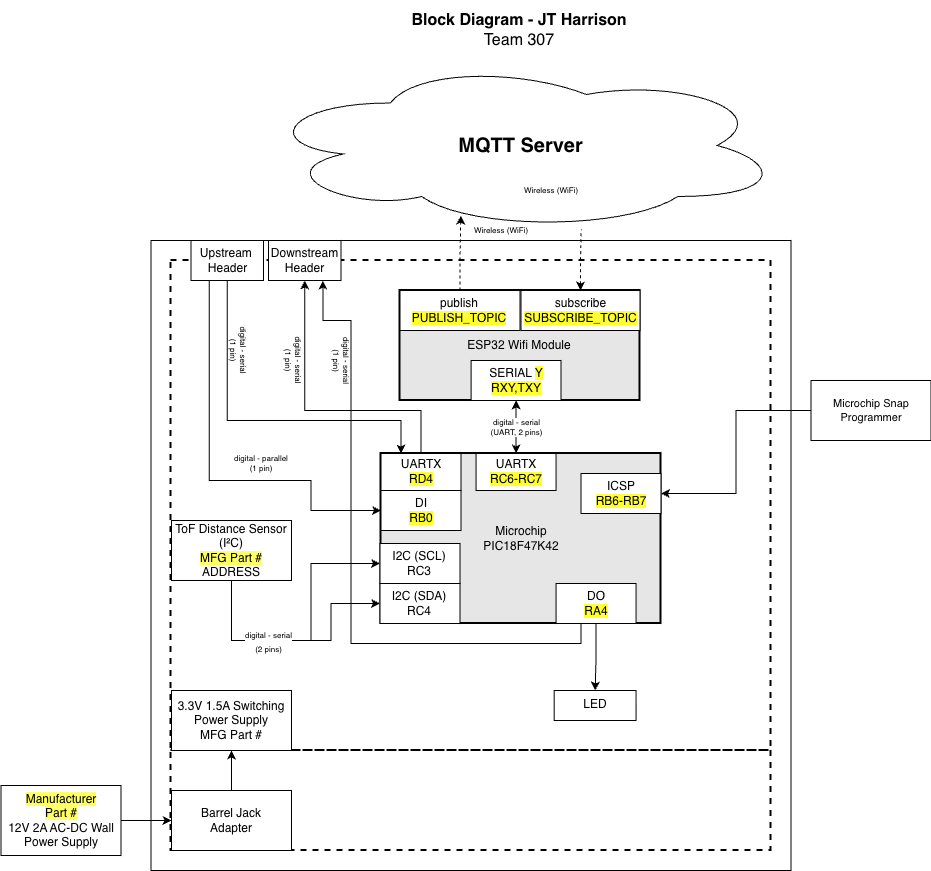

## Overview

This block diagram shows how the distance module is organized and how it is connected. A ToF distance sensor provides distance measurements to a PIC18F47K42 microcontroller, where the data is processed and indicated using a debug LED. The microcontroller communicates with an ESP32 over UART and is capable of wireless communications. It will be powered by regulated 3.3 V power regulator from a 9V barrel jack supply and headers allow the module to integrate with the rest of the teams system.

## TOF Sensor Module Block Diagram

