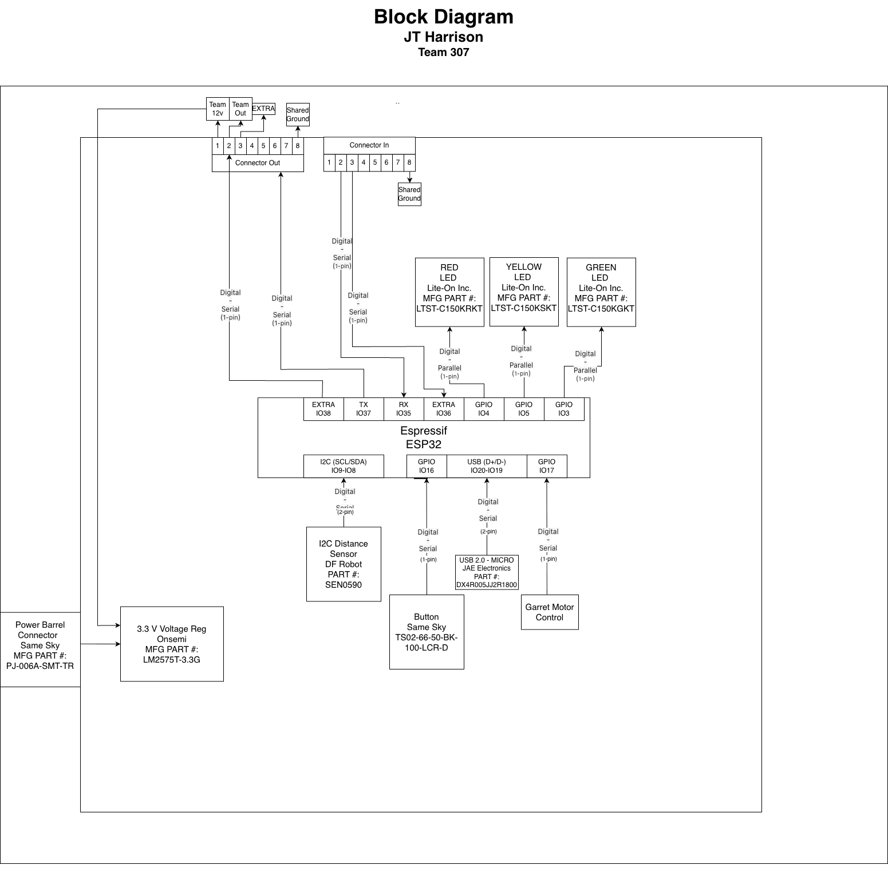

## Overview

This block diagram shows how the distance module is organized and how it is connected. A ToF distance sensor provides distance measurements to an ESP32 microcontroller, where the data is processed and indicated using debug LEDs. The ESP32 communicates distance information to the rest of the team system through the module connectors and is capable of wireless communication. It will be powered by a regulated 3.3 V power regulator from a 9V barrel jack supply and headers allow the module to integrate with the rest of the teams system. A dedicated connection will also be to Garrets motor control.

## Distance Sensor Module Block Diagram

## Decison Making Rationale

The block diagram for the distance sensor subsystem was designed by first identifying the need for obstacle detection and communication with the rest of the team. An ESP32 was selected as the main controller because it can handle both I2C communication with the I2C distance sensor and UART communication. The sensor provides distance data that is processed and used to determine system states, while the LED shows the state changes. A regulated 3.3 V power supply powers the system and standard connectors allow the subsystem to integrate with the rest of the team. Overall, the design meets the product requirements by enabling accurate sensing with an I2C, real time integration and dependability on the system from the rest of the team and communication protocol.

The block diagram as a PDF download is available [*here*](block.pdf)