This page outlines the main components selected for the I2C ToF sensor module, starting with the supporting power, sensing, and indicator components used in the design and ending with the selected microcontroller PIC18F47K42. 

### Power Management

**3.3 V Regulator**

| **Component** | **Pros** | **Cons** |
|---|---|---|
| 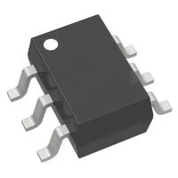 **LMR16006YQ3DDCRQ1**   [link to product](https://www.digikey.com/en/products/detail/texas-instruments/LMR16006YQ3DDCRQ1/5395814) | \* fixed 3.3V output  \* wide input range  \* stable current for components| \* needs inductor + caps  \* layout must be clean |
| 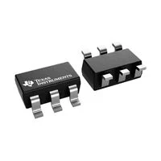 **TPS560430X3FDBVT**   [link to product](https://www.digikey.com/en/products/detail/texas-instruments/TPS560430X3FDBVT/9861429) | \* fixed 3.3V output \* simple style  \* small footprint | \* needs inductor + caps \* layout needs to reduce noise |
| 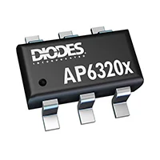 **AP63203WU-7**  [link to product](https://www.digikey.com/en/products/detail/diodes-incorporated/AP63203WU-7/9858426) | \* fixed 3.3V output \* alot of current  \* common part | \* needs inductor + caps \* requires good PCB layout |

**Barrel Jack**

| **Component** | **Pros** | **Cons** |
|---|---|---|
| 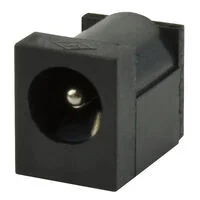 **PJ-006A-SMT-TR (2.1mm)**   $0.95/each [link to product](https://www.digikey.com/en/products/detail/same-sky-formerly-cui-devices/PJ-006A-SMT-TR/408456) | \* standard 2.1mm adapter size \* surface mount \* availability \* rated above 9V | \* tough footprint  \* needs strong ground pad support |
|  **PJ-006B-SMT-TR (2.1mm)**   $0.95/each [link to product](https://www.digikey.com/en/products/detail/same-sky-formerly-cui-devices/PJ-006B-SMT-TR/408457) | \* standard 2.1mm plug \* surface mount \* clean pcb layout | \* small footprint |
| 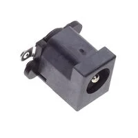 **KLDVX-SMT-02-BTR (2.1mm)**  $1.40/each [link to product](https://www.digikey.com/en/products/detail/kycon-inc/KLDVX-SMT-02-BTR/10247017) | \* Vertical orientation option \* surface mount | \* Larger footprint \* Slightly higher cost |

### I2C (ToF) Sensor

| **Component** | **Pros** | **Cons** |
|---|---|---|
| 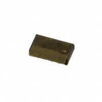 **VL53L0CXV0DH/1**  [link to product](https://www.digikey.com/en/products/detail/stmicroelectronics/VL53L0CXV0DH-1/6023691)| \* widely used ToF sensor \* works directly at 3.3V \* good for 2-6 ft detection | \* Small  \* Requires good PCB footprint |
| 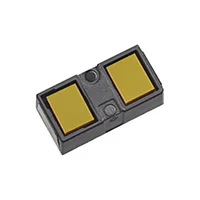 **VL53L1CXV0FY/1**  [link to product](https://www.digikey.com/en/products/detail/stmicroelectronics/VL53L1CXV0FY-1/8258055?s=N4IgTCBcDaIGoBkCsBmBBGAwgDTgBgDEBNAenRAF0BfIA)| \* long range capability \* adjustable timing \* 3.3V compatible | \* small  \* configuration is complex |
| 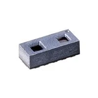 **TMF8821**   [link to product](https://www.digikey.com/en/products/detail/ams-osram-usa-inc/TMF8821-1AM/16285681) | \* multi zone detection \* 3.3V compatible \* fits requirements| \* small  \* Requires good PCB layout |

### LED Debug Light ###

| **Component** | **Pros** | **Cons** |
|---|---|---|
| 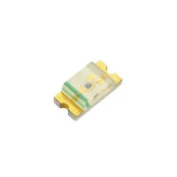 **LTST-C150GKT** (Green LED)  [link to product](https://www.digikey.com/en/products/detail/liteon/LTST-C150GKT/269216?s=N4IgTCBcDaIDIBUDKCC0BhAjAVgAwHEBpBEAXQF8g)| \* easy to solder  \* good for power/status indicator \*low current draw | \* requires series resistor |
|  **LTST-C150KRKT** (Red LED) [link to product](https://www.digikey.com/en/products/detail/liteon/LTST-C150KRKT/386761?s=N4IgTCBcDaIDIBUDKCC0BhAjAVgAwGkAlfBEAXQF8g)| \* visible error/stop indicator \* low voltage \* easy solder size | \* requires series resistor |
| 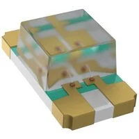 **LTST-C150TBKT** (Blue LED) [link to product](https://www.digikey.com/en/products/detail/liteon/LTST-C150TBKT/388526?s=N4IgTCBcDaIDIBUDKCC0BhAjAVgAwICEBpBEAXQF8g)| \* clean look \* good for activity/comms indicator  \* easy to solder | \* slightly higher voltage |

### Microcontroller

Below is my selected microcontroller, for a more detailed explanation please visit the [Microcontroller Selection Page](https://jtharri6.github.io/egr314/03-Microcontroller%20Selection/Microcontoller%20Selection/).

| **Component** | **Pros** | **Cons** |
|---|---|---|
| 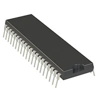 **PIC18F47K42**   [link to product](https://ww1.microchip.com/downloads/en/DeviceDoc/PIC18(L)F26-27-45-46-47-55-56-57K42-Data-Sheet-40001919G.pdf) | \* PIC used in class  \* easy to use  \* peripherals for I2C ToF and UART | \* needs good decoupling and 3.3V rail \* PCB layout|

## Final Components Selection

| Main Components Chosen | Purpose | Reason Chosen |
|------------------------|----------|---------------|
| PJ-006A-SMT-TR | 9V power input | standard 2.1mm adapter size, surface mount, and reliable for 9V input |
| TPS560430X3FDBVT | 3.3V voltage regulation | fixed 3.3V output and small footprint for stable power conversion |
| VL53L0CXV0DH/1 | Distance sensing (I2C ToF) | widely used ToF sensor that works directly at 3.3V and fits the 2ft to 6ft detection range |
| LTST-C150KRKT | Debug/status indicator light | visible and low voltage LED that is easy to solder and works well on 3.3V systems |

