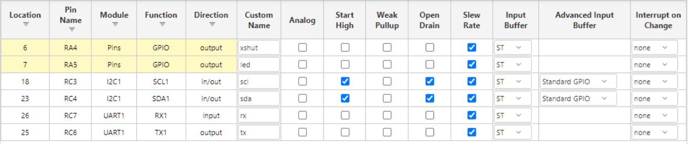

This page describes the selection of the microcontroller used in the sensing module. It outlines why the PIC18F47K42 was chosen, the communication required and the necessary pins.

## Selected Microcontoller

**Microcontroller:** PIC18F47K42 (40 pin PDIP)

The PIC18F47K42 was selected as the final microcontroller for this sensing subsystem because it provides the communication features and flexibility required for this design.

The PIC18F47K42 provides:
- Built in I2C support for reading distance data from the VL53L0X sensor.
- Multiple UART modules for sending distance and status data to the motor module.
- More than enough GPIO pins for sensor control and a debug LED.
- Flexible pin mapping 
- Reliable operation at 3.3V
- Support for programming and debugging

| Peripheral / Resource | # Available | # Needed | Associated Pins |
|---|---:|---:|---|
| UART | 2 | 1 | TX1-RC6, RX1-RC7  |
| I2C | 2 | 1 | SCL-RC3, SDA-RC4 (ToF sensor) |
| GPIO | 35 I/O pins | 2 | RA4-XSHUT, RA5-LED|
| ADC |  (available) | 0 | Not used |

## MCC Configuration Pin Layout

### Communication to the Motor Module

- This sensing module reads the distance value from the ToF sensor using I2C.
- The processed distance information is sent to the motor control module through UART.
- The motor module determines how to respond based on the received data including stopping, slowing down, or turning to avoid obstacles.

