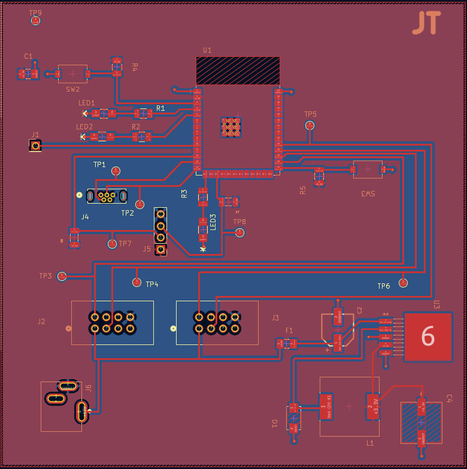
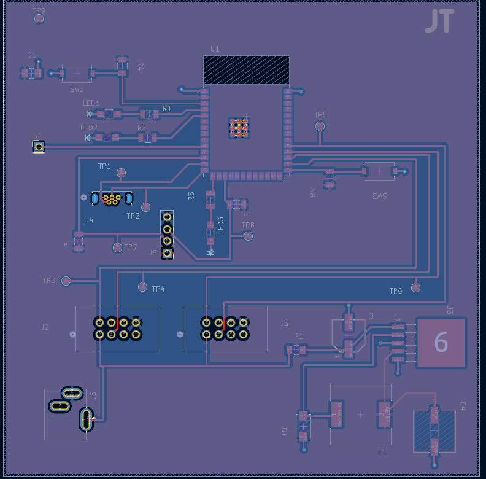

## Overview

## Raw PCB KiCad Design

### Front Copper PCB

### Back Grounding PCB

## Final Design PCB

## Files
* ECad Zip folder of the project can be found [*here*](dissen.zip)
* Gerber Zip folder can be found [*here*](JT_Gerber11.zip).
