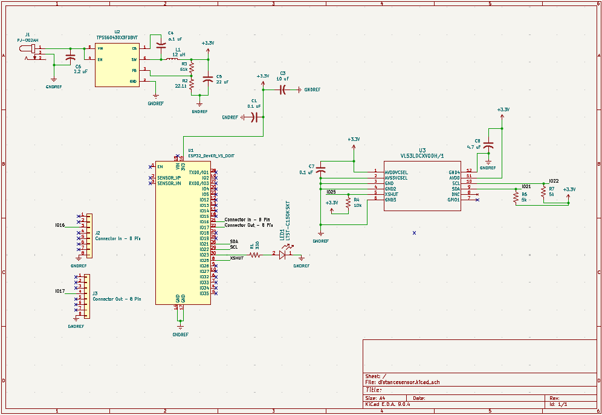

## Overview

This schematic shows the complete electrical design of the distance sensing module. The system is powered through a barrel jack and 3.3V regulated power to safely power all components. An ESP32 serves as the main controller, communicating with the VL53L0X distance sensor using I²C. The design also includes an indicator LED for feedback status and 8 pin input/output connectors to allow communication between team modules.

{style width:"350" height:"300;"}
**Figure 01:I2C ToF Sensor** 

## Resouces

The schematic as a PDF download is available [*here*](distancesensor.pdf), and the Zip folder of the project [*here*](distancesensor.zip).