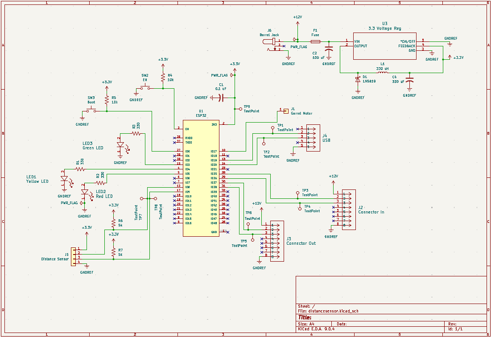

## Overview

This schematic shows the complete electrical design of the distance sensing module and how all components connect. The system is powered through a barrel jack that feeds a 3.3V voltage regulator, while an ESP32 serves as the main controller, communicating with the distance sensor through I²C. The design also includes indicator LEDs for system status, push buttons for boot and enable control, and communication headers that allow the module to "talk" with other team subsystems. A USB connection is included for programming and debugging the ESP32.

{style width:"350" height:"300;"}
**Figure 01:I2C ToF Sensor** 

## Resouces

The schematic as a PDF download is available [*here*](distancesensor.pdf), and the Zip folder of the project [*here*](distancesensor.zip).