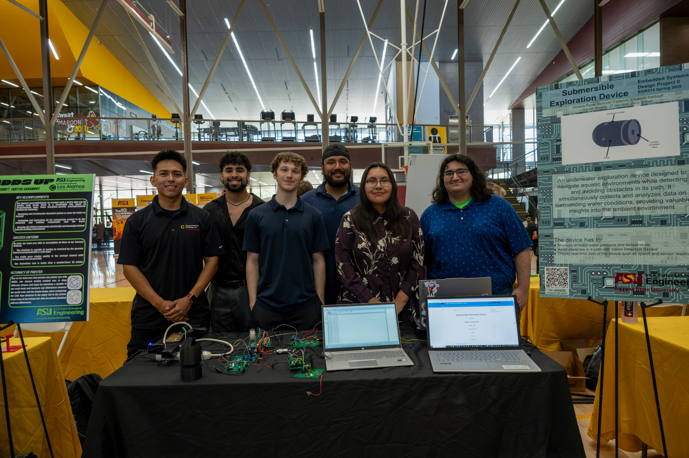

JT Harrison Datasheet 
as part of 
 Submersible Exploration Device 
for 
 Team 307  

**Submission: May 04, 2026**

## Introduction

This datasheet describes the design and functionality of the distance sensing module used in the exploration device. The purpose of this document is to outline the hardware components, operation, and system integration of the module. The distance sensing module measures the proximity of nearby objects and provides measurement data to the system microcontroller to support navigation and environmental awareness.

### Project Summary

* Team 307 is developing a submersible exploration device designed to operate in aquatic environments for monitoring and sample collection. The system combines multiple sensors, microcontrollers, and communication interfaces to gather and process environmental data such as temperature, pressure, and distance measurements. These measurements allow the system to monitor water conditions and assist with navigation during exploration missions.

* Team 307 Webpage
[Click here to visit Team 307 Project Page](https://egr-314-team-307-spring-2026.github.io/Team307.github.io/)

### My Contribution

* My primary responsibility is the development of the distance sensing subsystem. This work includes selecting an appropriate distance sensor, integrating the sensor with the system microcontroller, and designing the required circuitry for communication. The module communicates with the microcontroller using an I2C interface and provides real time distance measurements that support obstacle detection and situational awareness during its operation.

## Project Navigation

Use the links below to quickly access each section:

- [Requirements](https://jtharri6.github.io/egr314/01-Requirements/Requirements/)
- [Block Diagram](https://jtharri6.github.io/egr314/02-Block-Diagram/Block-Diagram/)
- [Component Selection](https://jtharri6.github.io/egr314/03-Component-Selection/Component-Selection/)
- [Microcontroller Selection](https://jtharri6.github.io/egr314/03-Microcontroller%20Selection/Microcontoller%20Selection/)
- [Bill of Materials (BOM)](https://jtharri6.github.io/egr314/05-BOM/BOM/)
- [PCB Design](https://jtharri6.github.io/egr314/06-PCB%20Design/PCB%20Design/)
- [Schematic](https://jtharri6.github.io/egr314/07-Schematic/schematic/)
- [Power Budget](https://jtharri6.github.io/egr314/08-Power%20Budget/Power%20Budget/)
- [API](https://jtharri6.github.io/egr314/09-API/API/)
- [Hardware V2.0](https://jtharri6.github.io/egr314/10-Hardware%20V2.0/Hardware%20V2.0/)
- [Resources](https://jtharri6.github.io/egr314/11-Resources/Resources/)
- [Reflection](https://jtharri6.github.io/egr314/12-Reflection/Reflection/)
- [Appendix](https://jtharri6.github.io/egr314/Appendix/)

## Team Picture

### Helpful Links

* Distance Sensor Module Block Diagram: [Link](https://jtharri6.github.io/egr314/02-Block-Diagram/Block-Diagram/)

* Distance Sensor Component Selection: [Link](https://jtharri6.github.io/egr314/03-Component-Selection/Component-Selection/)

* Distance Sensor Module BOM: [Link](https://jtharri6.github.io/egr314/05-BOM/BOM/)

* Distance Sensor Module Schematic: [Link](https://jtharri6.github.io/egr314/08-Schematic/schematic/)

* ECad Zip folder of the project can be found [*here*](dissen.zip).

